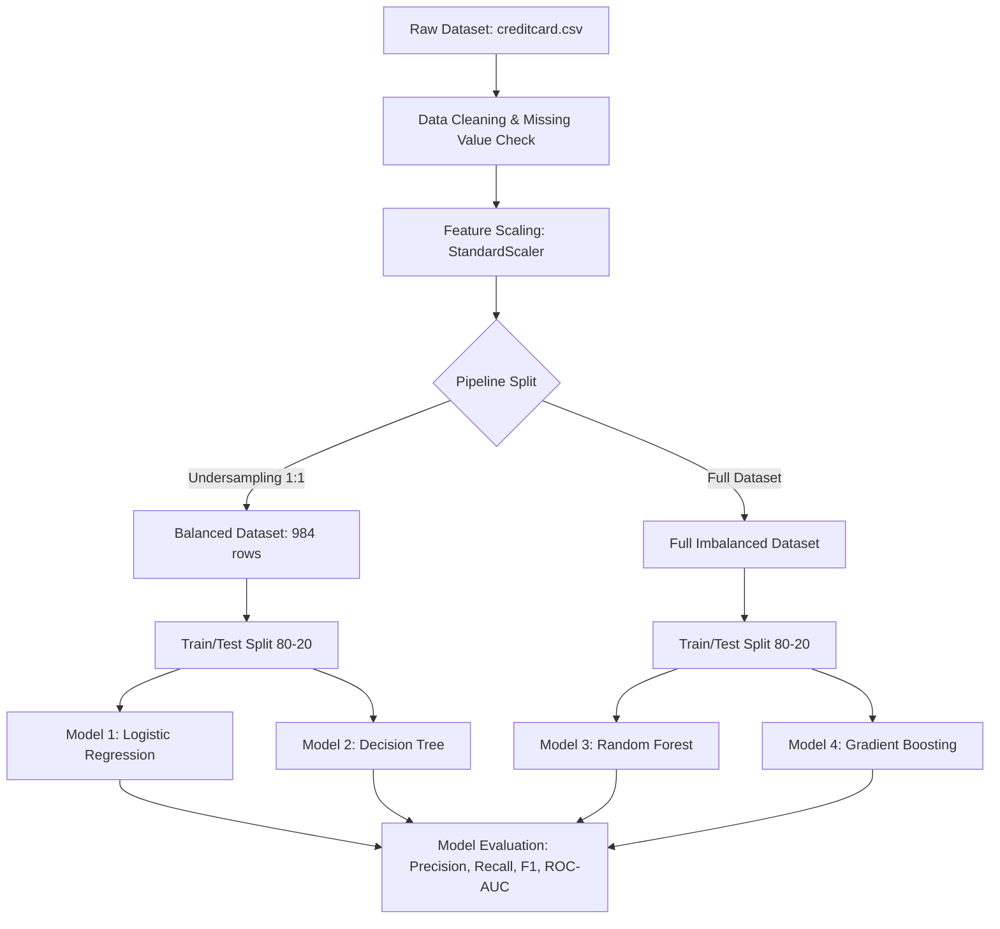

# 💳 Credit Card Fraud Detection using Machine Learning

[](https://www.python.org/)
[](https://scikit-learn.org/)
[](https://jupyter.org/)
[]()

An end-to-end Machine Learning project designed to detect fraudulent credit card transactions. This repository covers everything from exploratory data analysis (EDA), data cleaning, scaling, handling severe class imbalance via random under-sampling, to training and evaluating various predictive classifiers.

---

## 📌 Table of Contents
1. [Overview & Motivation](#-overview--motivation)
2. [Dataset Description](#-dataset-description)
3. [Project Pipeline & Workflow](#-project-pipeline--workflow)
4. [Machine Learning Models](#-machine-learning-models)
5. [Evaluation Metrics & Performance Results](#-evaluation-metrics--performance-results)
6. [Project Structure](#-project-structure)
7. [Installation & Getting Started](#-installation--getting-started)

---

## 🔍 Overview & Motivation
Credit card fraud is one of the most prominent financial threats globally, causing billions of dollars in losses annually. Identifying fraudulent transactions is incredibly challenging because:
* Fraudulent transactions account for a minuscule fraction (less than 0.2%) of all transactions.
* Normal transactions must not be flagged incorrectly (false positives), as it degrades user experience.
* Real-time classification is essential.

This project implements and compares four robust machine learning models to detect fraud accurately, addressing the dataset's heavy imbalance through **Random Under-Sampling (RUS)**, standardizing features, and analyzing standard classification metrics like Precision, Recall, and F1-Score.

---

## 📊 Dataset Description
The dataset used is the popular Kaggle **Credit Card Fraud Detection Dataset**, which contains transactions made by European cardholders in September 2013.
* **Total Transactions:** 284,807
* **Fraudulent Transactions:** 492 (0.172% of total)
* **Normal Transactions:** 284,315 (99.828% of total)
* **Confidentiality:** Due to privacy constraints, features $V_1, V_2, \dots, V_{28}$ are numerical input variables obtained using Principal Component Analysis (PCA) dimensionality reduction. 
* **Non-PCA Features:**
  * `Time`: Seconds elapsed between each transaction and the first transaction.
  * `Amount`: The monetary value of the transaction.
  * `Class`: The target variable, where `1` represents fraud and `0` represents a normal transaction.

> **Note:** The extreme imbalance requires specialized techniques. Standard accuracy is not a reliable metric for this dataset since a model predicting all transactions as "normal" would achieve 99.82% accuracy but detect 0% of fraud.

---

## ⚙️ Project Pipeline & Workflow



1. **Exploratory Data Analysis (EDA):** Visualizing the class distribution to verify the imbalance ratio.
2. **Missing Value Handling:** Checking for missing values (any nulls found are dropped, though the dataset is highly clean).
3. **Feature Normalization:** Using `StandardScaler` to scale the `Time` and `Amount` columns to ensure they don't skew model coefficients/weights.
4. **Balancing the Dataset (Random Under-sampling):**
   * Since there are only 492 fraud cases, we sample 492 normal transactions at random.
   * Concat both classes to form a balanced sub-dataset of **984 transactions** (50% Normal, 50% Fraud).
5. **Splitting the Data:**
   * Split the balanced dataset for models that benefit from balanced training (Logistic Regression, Decision Tree).
   * Split the full scaled dataset for ensemble models capable of handling high dimensions and class imbalances (Random Forest, Gradient Boosting).

---

## 🤖 Machine Learning Models
Four distinct classifiers were developed, optimized, and evaluated:

1. **Logistic Regression:** Trained on the balanced undersampled dataset. Offers highly interpretable coefficients and forms our statistical baseline.
2. **Decision Tree Classifier (Entropy Criterion):** A tree-based model trained on the balanced dataset, using entropy for calculating information gain.
3. **Random Forest Classifier (Ensemble):** A powerful bagging ensemble estimator trained on the original dataset (using 20 estimators, max depth of 10, and entropy criterion).
4. **Gradient Boosting Classifier (Ensemble):** A sequential boosting estimator trained on the original dataset to minimize classification loss additively.

---

## 📈 Evaluation Metrics & Performance Results

Here is a performance comparison of the models:

| Model Classifier | Training Accuracy | Testing Accuracy | Precision (Fraud) | Recall (Fraud) | F1-Score (Fraud) | Dataset Mode |
| :--- | :---: | :---: | :---: | :---: | :---: | :---: |
| **Logistic Regression** | 93.90% | 93.91% | 1.00 | 0.88 | 0.93 | Balanced Subset |
| **Decision Tree** | 100.00% | 89.85% | 0.89 | 0.91 | 0.90 | Balanced Subset |
| **Random Forest** | 99.97% | 99.96% | 0.94 | 0.81 | 0.87 | Full Imbalanced Dataset |
| **Gradient Boosting** | 99.97% | 99.94% | 0.90 | 0.70 | 0.79 | Full Imbalanced Dataset |

### Key Observations:
* **Logistic Regression** trained on the balanced dataset achieves an outstanding F1-score of **0.93** with 100% precision on fraudulent transactions (no false positives in the test subset) and a recall of 88%.
* **Decision Tree** is prone to overfitting on the balanced dataset, achieving 100% training accuracy but dropping to 89.85% testing accuracy.
* **Random Forest** and **Gradient Boosting** evaluate well on the full imbalanced test set, with Random Forest achieving a balanced F1-score of **0.87** on the minority class.

---

## 📂 Project Structure

```
Credit_Card_Fraud_Detection/
│
├── Code/
│   └── Credit_Card_Fraud_Detection.ipynb   # Main Jupyter Notebook with code & visualizations
│
├── Dataset/
│   └── creditcard.csv                      # Source data (Ignored in Git, download details below)
│
├── Synopsis/
│   ├── Synopsis.pdf                        # Project Synopsis (PDF)
│   └── Synopsis.DOCX                       # Project Synopsis (DOCX)
│
├── Report/
│   ├── Report.pdf                          # Detailed Project Report (PDF)
│   ├── Report.DOCX                         # Detailed Project Report (DOCX)
│   ├── MINI_FRONT[1].pdf                   # Report Cover/Front Page (PDF)
│   └── MINI_FRONT[1].docx                  # Report Cover/Front Page (DOCX)
│
├── ppt/
│   └── CREDIT_CARD_FRAUD_DETECTION_Finalised[2].pptx  # Final Presentation PPTX
│
├── .gitignore                              # Excludes large files, notebooks cache, IDE configs
└── README.md                               # Project documentation (this file)
```

---

## 🚀 Installation & Getting Started

### 1. Prerequisites
Make sure you have Python (version 3.8 or above) installed on your system.

### 2. Clone the Repository
```bash
git clone https://github.com/your-username/Credit_Card_Fraud_Detection.git
cd Credit_Card_Fraud_Detection
```

### 3. Install Required Dependencies
You can install the required packages using pip:
```bash
pip install pandas numpy scikit-learn matplotlib seaborn jupyter
```

### 4. Download the Dataset
1. Visit the [Kaggle Credit Card Fraud Detection page](https://www.kaggle.com/datasets/mlg-ulb/creditcardfraud).
2. Download the `creditcard.csv` file.
3. Place the downloaded `creditcard.csv` file inside the `Dataset/` directory.

### 5. Running the Jupyter Notebook
Start the Jupyter Notebook server:
```bash
jupyter notebook Code/Credit_Card_Fraud_Detection.ipynb
```
Once opened, run all cells to reproduce the findings, plots, and models.

